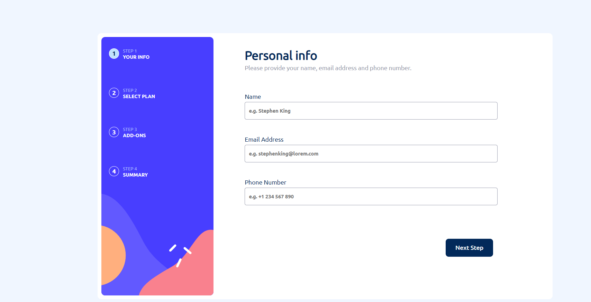
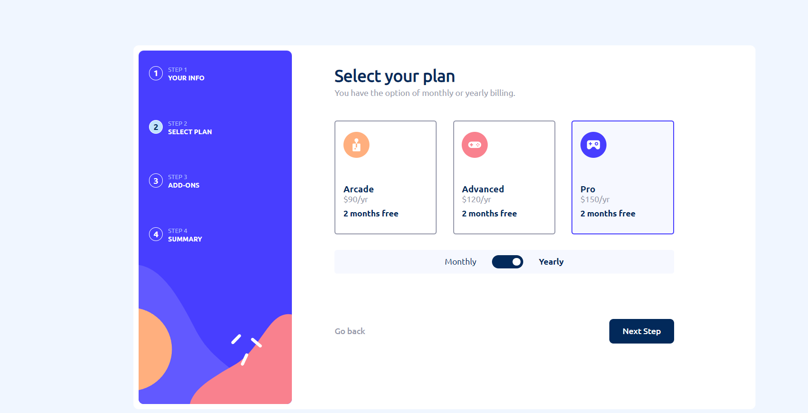
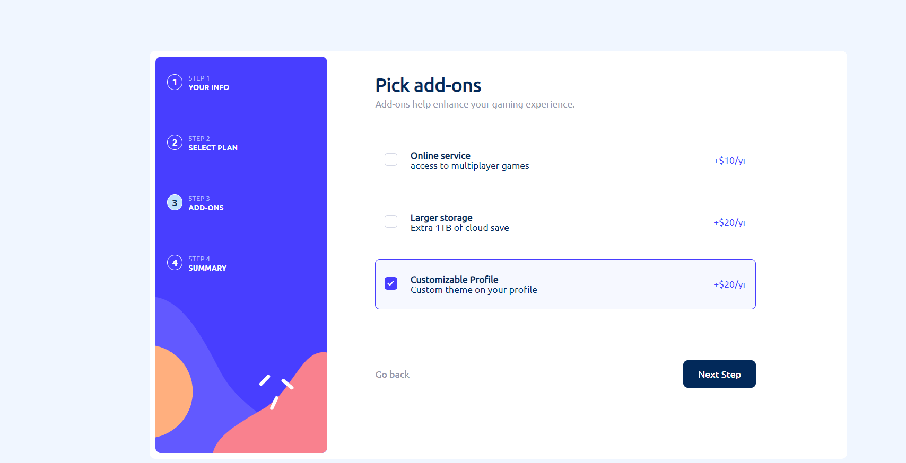

# Site [Multi Step Form](https://kvn-multi-step-form.vercel.app)

Este projeto foi baseado em um desafio do site [Frontend mentor](https://www.frontendmentor.io/challenges). Clique no link acima para visitá-lo.

## Conhecimentos adquiridos
Aprimorei minhas habilidades em:
* Next.js
* Javascript
* Css
* HTML
* Git/GitHub
* Design de páginas web, especialmente voltados a formulários e inputs

## Sobre o Frontend Mentor
É um site que disponibiliza desafios que envolvem a criação de páginas voltadas para o frontend. Ele te dá arquivos com os textos utilizados, imagens de como o site deve ficar e uma lista com as fontes e cores que devem ser utilizadas. Fora isso, todo o trabalho é com você!

## Capturas de tela desktop
Personal Info

Select your plan

Pick Add-Ons

Finishing Up

Caso queira ver a estilização para dispositivos móveis, além de vários outros detalhes, <a href="https://kvn-multi-step-form.vercel.app" target="_blank">clique aqui para visitar o site 👆</a>!
